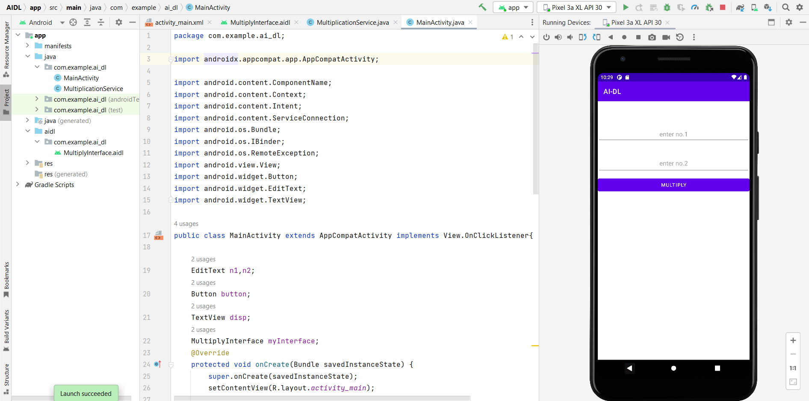
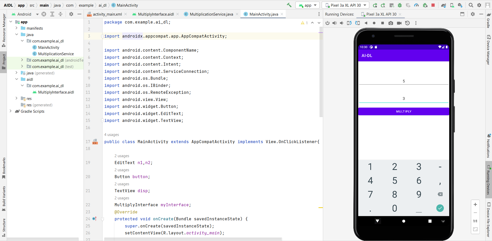
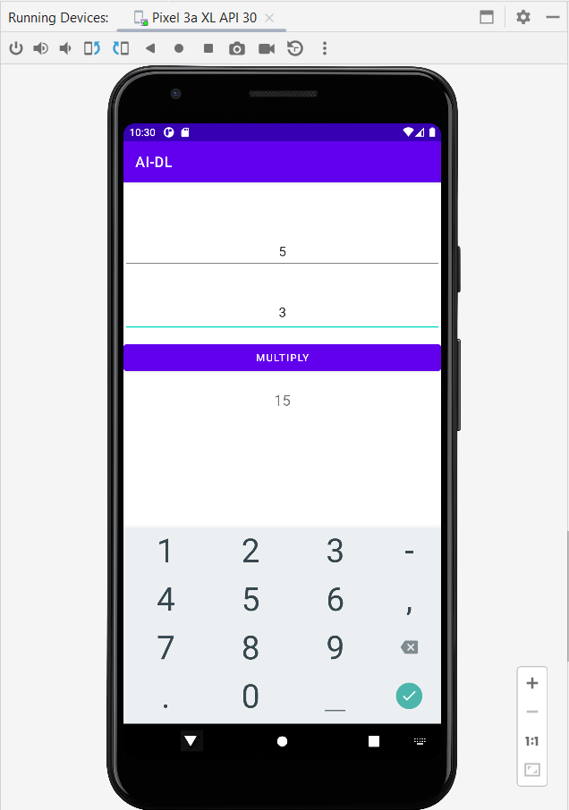

# Ex.No:2 Create a simple application client and server service using AIDL interface in android studio.

## AIM:

To create a AIDL interface and communicate the process between client and server using AIDL interface in Android Studio.

## EQUIPMENTS REQUIRED:

Android Studio(Min.required Artic Fox)

## ALGORITHM:

Step 1: Open Android Stdio and then click on File -> New -> New project.

Step 2: Then type the Application name as CSAIDL and click Next.

Step 3: Then select the Minimum SDK as shown below and click Next.

Step 4: Then select the Empty Activity and click Next. Finally click Finish.

Step 5: Design layout in activity_main.xml.

Step 6: Display message give in MainActivity file(client/server).

Step 7: Save and run the application.

## PROGRAM:

```
/*
Program to print the client/server services using AIDL”.
Developed by: Pradeesh S
Registeration Number : 212221240038
*/
```

### activity_main.xml

```xml
<?xml version="1.0" encoding="utf-8"?>
<LinearLayout xmlns:android="http://schemas.android.com/apk/res/android"
    xmlns:app="http://schemas.android.com/apk/res-auto"
    xmlns:tools="http://schemas.android.com/tools"
    android:layout_width="match_parent"
    android:layout_height="match_parent"
    android:orientation="vertical"
    tools:context=".MainActivity" >

    <EditText
        android:id="@+id/ed1"
        android:layout_width="match_parent"
        android:layout_height="wrap_content"
        android:layout_marginTop="70dp"
        android:ems="10"
        android:gravity="center"
        android:hint="enter no.1"
        android:inputType="number"
        android:minHeight="48dp" />

    <EditText
        android:id="@+id/ed2"
        android:layout_marginTop="30dp"
        android:layout_width="match_parent"
        android:layout_height="wrap_content"
        android:ems="10"
        android:height="48dp"
        android:hint="enter no.2"
        android:padding="16dp"
        android:gravity="center"
        android:inputType="number" />

    <Button
        android:id="@+id/btn"
        android:layout_width="match_parent"
        android:layout_height="wrap_content"
        android:text="Multiply"
        android:layout_marginTop="10dp"/>

    <TextView
        android:id="@+id/txt"
        android:gravity="center"
        android:textSize="20dp"
        android:layout_width="match_parent"
        android:layout_height="wrap_content"
        android:layout_marginTop="20dp"/>
</LinearLayout>
```

### MultiplyInterface.aidl

```java
// MultiplyInterface.aidl
package com.example.ai_dl;

// Declare any non-default types here with import statements

interface MultiplyInterface {

    int mul_res(int a,int b);
}
```

### MultiplicationService.java

```java
package com.example.ai_dl;

import android.app.Service;
import android.content.Intent;
import android.os.IBinder;
import android.os.RemoteException;

public class MultiplicationService extends Service {
    public MultiplicationService() {
    }

    @Override
    public IBinder onBind(Intent intent) {


        return myBinder;
    }

    MultiplyInterface.Stub myBinder = new MultiplyInterface.Stub() {
        @Override
        public int mul_res(int a, int b) throws RemoteException {
            return a*b;
        }
    };
}
```

### Main Activity.java

```java
package com.example.ai_dl;

import androidx.appcompat.app.AppCompatActivity;

import android.content.ComponentName;
import android.content.Context;
import android.content.Intent;
import android.content.ServiceConnection;
import android.os.Bundle;
import android.os.IBinder;
import android.os.RemoteException;
import android.view.View;
import android.widget.Button;
import android.widget.EditText;
import android.widget.TextView;

public class MainActivity extends AppCompatActivity implements View.OnClickListener{

    EditText n1,n2;
    Button button;
    TextView disp;
    MultiplyInterface myInterface;
    @Override
    protected void onCreate(Bundle savedInstanceState) {
        super.onCreate(savedInstanceState);
        setContentView(R.layout.activity_main);

        n1= (EditText) findViewById(R.id.ed1);
        n2= (EditText) findViewById(R.id.ed2);
        button= (Button) findViewById(R.id.btn);
        disp= (TextView) findViewById(R.id.txt);

        button.setOnClickListener(MainActivity.this);
        Intent multiply = new Intent(MainActivity.this,MultiplicationService.class);
        bindService(multiply,myServiceConnection, Context.BIND_AUTO_CREATE);

    }

    ServiceConnection myServiceConnection = new ServiceConnection() {
        @Override
        public void onServiceConnected(ComponentName name, IBinder service) {

            myInterface = MultiplyInterface.Stub.asInterface(service);
        }

        @Override
        public void onServiceDisconnected(ComponentName name) {

        }
    };

    @Override
    public void onClick(View v) {
        int x=Integer.parseInt(n1.getText().toString());
        int y=Integer.parseInt(n2.getText().toString());
        try {
            int z = myInterface.mul_res(x,y);
            disp.setText(z + "");
        } catch (RemoteException e) {
            throw new RuntimeException(e);
        }
    }
}
```

## OUTPUT







## RESULT

Thus a Simple Android Application to create a AIDL interface and communicate the process between client and server using AIDL interface in Android Studio is developed and executed successfully.
